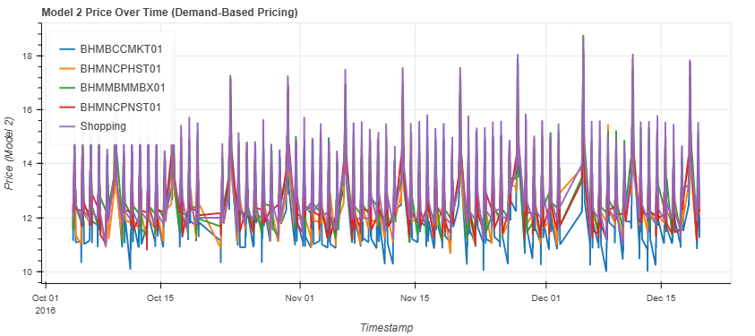

# Real-Time Dynamic Pricing System for Urban Parking Lots  
**Simulating Smart Parking Prices Based on Demand, Traffic, and Location**

---

## Introduction

Urban cities struggle with unpredictable parking demand, traffic congestion, and static pricing systems that fail to respond to real-world changes. Most parking lots charge a fixed rate, regardless of whether they are half-empty or overfull. This results in wasted space in low-demand areas and long queues in others.

To address this, we built a **real-time pricing system** that dynamically adjusts parking rates using live features such as occupancy, traffic congestion, vehicle type, special days, and the presence of nearby competitor lots. The system uses a time-stamped dataset of 18,000+ records collected across 14 lots over 73 days and simulates intelligent pricing behavior using three models.  

It is designed to help cities distribute parking usage more evenly, improve lot efficiency, and offer fairer pricing to drivers.

---

## Objectives

- Build 3 pricing models:
  1. **Model 1**: Linear baseline pricing using occupancy  
  2. **Model 2**: Demand-weighted pricing using multiple features  
  3. **Model 3**: Competitive pricing based on nearby lots  
- Simulate pricing updates using time-based streaming logic
- Visualize pricing trends for each lot using interactive plots
- (Optional) Suggest rerouting when a parking lot is overburdened

---

## Tech Stack Used

| Function             | Tools Used                      |
|----------------------|----------------------------------|
| Programming          | Python (Google Colab)           |
| Data Manipulation    | Pandas, NumPy                   |
| Visualization        | Bokeh (for interactive plots)   |
| Simulation Logic     | Pathway (offline logic used)    |
| Geolocation          | Haversine Formula               |
| Version Control      | Git & GitHub                    |

---

## Dataset Overview

The dataset captures the behavior of 14 parking lots from 8:00 AM to 4:30 PM in 30-minute intervals.

Each record includes:

- `SystemCodeNumber`: Unique parking lot ID  
- `Capacity`, `Occupancy`, `QueueLength`  
- `TrafficConditionNearby`: (low, average, high)  
- `VehicleType`: (car, bike, truck)  
- `IsSpecialDay`: binary flag  
- `LastUpdatedDate` + `Time`: Combined into a single `Timestamp`  
- `Latitude`, `Longitude`: Used for geo-based modeling

---

## Data Preprocessing & Feature Engineering

- Combined date & time into a single `Timestamp` column  
- Calculated **Occupancy Rate** = Occupancy ÷ Capacity  
- Encoded categorical variables (`VehicleType`, `Traffic`) into numeric weights  
- Normalized `QueueLength` and demand scores  
- Used the Haversine formula to compute distance between lots  
- Sorted all records by timestamp to simulate streaming

---

## Pricing Models

### 🔹 Model 1: Linear Occupancy-Based Pricing

- Price increases linearly with occupancy rate  
- Formula: `Price = Previous_Price + α × (Occupancy / Capacity)`  
- Starting price: ₹10  
- Used as the baseline for comparisons

---

### 🔹 Model 2: Demand-Based Pricing

- Calculates a weighted **Demand Score** from:
  - Occupancy Rate  
  - Queue Length  
  - Traffic Level  
  - Special Day  
  - Vehicle Type Weight  

- Demand is normalized between 0–1  
- Price is calculated as:  
  `Price = Base × (1 + λ × Normalized_Demand)`

- Smoothly bounded between 0.5× and 2× base price

---

### Model 3: Competitive Pricing (Geo-Aware)

- Compares each lot’s price with **nearby competitors** (within 0.5 km)  
- If lot is full and others are cheaper → reduce price  
- If lot is underused and others are expensive → increase slightly  
- Uses **latitude/longitude** and Haversine distance to simulate local competition  
- Adjusts price intelligently based on surrounding options

---

## Real-Time Simulation

To mimic streaming data, the dataset is sorted by timestamp, and pricing models are applied row-by-row in chronological order. This creates a pseudo real-time simulation.

Each row simulates:
- A vehicle arriving at a lot
- A new price being calculated based on the current state
- The updated price being visualized

This allows us to analyze pricing patterns throughout the day, across different lots.

---

## Visualization: Bokeh Interactive Price Chart

A Bokeh plot was created to visualize price over time for multiple parking lots.

- X-axis: Timestamp  
- Y-axis: Price (₹)  
- Each line: A unique parking lot  
- Zoom, hover, and tooltip support included



---

## Key Results & Learnings

- **Model 1** is simple but too static — doesn't account for real-world features  
- **Model 2** is more responsive — prices adapt smoothly to queue, traffic, and time  
- **Model 3** improves fairness — prices adjust in response to local competition  
- Demand-based pricing helps spread traffic across lots  
- Competitive pricing prevents overcrowding in popular areas

---

## System Architecture (Mermaid Diagram)

```mermaid
graph TD
    A[Raw Dataset (CSV)] --> B[Feature Engineering]
    B --> C[Model 1: Linear]
    B --> D[Model 2: Demand-Based]
    B --> E[Model 3: Competitive]
    E --> F[Sorted Timestamp Simulation]
    F --> G[Bokeh Price Visualization]
```


